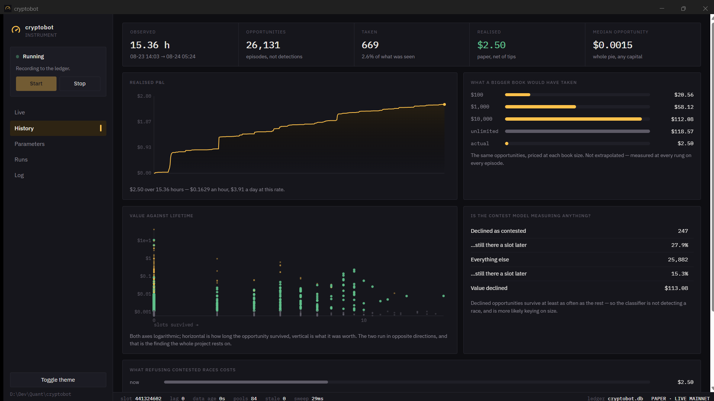

# dislocation_bps

**A measurement instrument for Solana AMM arbitrage.** It watches live mainnet, prices
every arbitrage cycle it can see, and records what *would* have cleared.

It exists to answer one question honestly: **is there a tradeable edge, and how big is
it?** The answer so far is **no** — the median opportunity is worth $0.0013 and the
cheapest round trip costs 2 bps.

It can also trade, as of 2026-08-30. That is a different thing from the answer being
yes: live execution was built on request, it is off behind four switches, and the
instrument's own measurements still say not to use it.

[](https://github.com/alenissacsam-2/dislocation_bps/actions/workflows/ci.yml)
[](https://github.com/alenissacsam-2/dislocation_bps/releases/latest)
[](LICENSE)




## The answer, so far

| | |
|---|---|
| Cheapest complete round trip anywhere in the universe | **2 bps** |
| Median opportunity, at the size that maximises it, at any capital | **$0.0013** |
| Max lifetime of every opportunity worth more than $0.10 | **0 slots** |

Opportunity size and opportunity lifetime run in **opposite directions**. Sub-cent gaps
loiter for seconds; every one worth more than a dime was gone before the next slot
began. There is no size at which an opportunity is both worth taking *and* still there
when you arrive — which answers "just add more capital" and "just go faster" with data
rather than argument.

The run in the screenshot above is representative: **26,131 opportunities** seen over
15 hours, 669 of them clearing, **$2.50** realised. Priced at a $10,000 book the same
opportunities come to $112 — and at unlimited capital, $118. The ladder flattens because
the cycles run out of *depth*, not funding, which is also the measurement that says a
flash loan would have added nothing.

### One finding is still open, and it matters

Edge rises with the fee of the route it is on — 2.16 bps on sub-5 bp routes, 11.95 bps
on routes over 50 bps — and most of the reported value sits on the expensive ones. That
ordering is backwards for real arbitrage: crossing a more expensive pool should leave
*less* behind, not more.

Two explanations have been tested. One was a definitional tautology in how the metric
was computed. The other, clock skew between pool observations, turned out to be real but
far too small to account for a 5× gradient. A later run did not reproduce the gradient at
all. **Until this is explained, treat the headline profit as unproven** — see §4 of
[`HANDOVER.md`](HANDOVER.md), which catalogues every way this instrument has already been
caught lying, including the ones that passed all their own tests.

## Install

Download `Cryptobot.Desk_<version>_x64-setup.exe` from the
[latest release](https://github.com/alenissacsam-2/dislocation_bps/releases/latest) and
run it. It installs per-user, so there is no admin prompt, and it carries both the
application and the bot.

**Nothing else is required** — no Rust, no WSL, no Node, no database server. Windows 10
(1809+) or 11, 64-bit, with the WebView2 runtime that ships with both.

An installed copy has no repository to read, so it keeps its config, ledger and archives
in `%LOCALAPPDATA%\cryptobot`, seeding a paper-mode config on first launch. The
Parameters tab prints the exact folder it settled on — a ledger whose location is a guess
is a ledger nobody can go and check.

## Build from source

Requires the Rust toolchain and Visual Studio Build Tools (the C++ workload, for a
linker). `scripts\build.ps1` checks for the latter up front and prints the one-line
`winget` command if it is missing.

```powershell
scripts\build.ps1
$env:LOCALAPPDATA\cryptobot-win-target\release\cryptobot-desk.exe --start
```

To produce the installer:

```powershell
cargo install tauri-cli --version "^2" --locked
scripts\installer.ps1
```

Run from a checkout, the repository *is* the root: the config beside `crates/` is the one
being edited, and the ledger lands where `cb-bot --report` will look for it.

## The two binaries

**`cryptobot-desk`** is the application. It starts and stops the bot, edits its
parameters, archives runs, and reads the ledger **whether or not anything is running** —
that last part is why it exists, because the browser dashboard it replaced was served by
the very process it was observing, so a stopped bot showed no history at all.

**`cb-bot`** is the instrument itself, and runs headless:

```powershell
cb-bot --report        # read the ledger without stopping the run
cb-bot --verify        # audit every decoder against an independent router
cb-verify-encode       # audit every swap encoder against live mainnet
```

> Run `cb-bot` from the repository root. It creates its ledger in the working directory,
> so started elsewhere it quietly opens a second, empty one — which reads exactly like a
> run that found nothing. This has already happened once.

Its API binds **loopback only** (`127.0.0.1:8787`) and has no authentication.

## How it works

```
crates/core       money math — constant-product and concentrated-liquidity quoting,
                  optimal input sizing, marginal edge
crates/dex        one pure decode function per venue, no network
crates/feed       websocket account subscriptions against mainnet
crates/scanner    pool store, snapshots, cycle enumeration
crates/ledger     SQLite — every sample, every clearing cycle, and the queries that
                  collapse detections into opportunities
crates/bot        the event loop, venue dispatch, --report and --verify
crates/server     event bus and three read-only API endpoints
crates/desk       the Windows application (Tauri v2)
crates/wallet     encrypted key custody — Argon2id, ChaCha20-Poly1305
crates/executor   swap encoding, PDA derivation, transaction assembly, risk limits
```

**The central mathematical fact**, in `crates/core/src/clmm.rs`: a concentrated-liquidity
pool inside its current tick is *exactly* a constant-product pool over virtual reserves
`x = L/√P`, `y = L·√P`. That identity is why five venues share one quote engine, and why
there is no second implementation to disagree with the first.

Currently decoding Orca Whirlpool, Raydium CLMM, Raydium CP-Swap, Raydium AMM v4, and
Meteora DAMM v2 — 84 pools live.

## Building a swap, and checking it against the chain

`crates/executor` encodes swaps for Orca Whirlpool and Raydium CLMM — 82 of the 90 pools
in the registry. The other three venues refuse by name rather than guessing; Raydium AMM
v4 alone would need nine OpenBook accounts this codebase has never read, to reach five
pools.

None of it can be verified from a development machine, so there is a tool that verifies
it against mainnet and **needs no key and no funds**:

```powershell
cb-verify-encode                      # account offsets and PDA derivations
cb-verify-encode --as <your address>  # and the instruction itself
```

`--as` takes a **public** address. Simulation runs with signature verification off, so a
placeholder signature is as good as a real one — a diagnostic never needs the wallet it
is diagnosing. Current result over the whole registry: **154 of 154 vault checks and 53
of 53 readable tick arrays agree with live mainnet, with no contradictions.**

Three things it found that reading documentation would not have:

- **A fresh keypair cannot be a fee payer.** The first version signed with a throwaway
  key, reasoning that an empty balance would stop before anything happened. An unfunded
  keypair has no account at all, so the runtime rejected every transaction before
  loading the program — 82 pools reporting `AccountNotFound` with no logs, which looks
  exactly like a broken encoder.
- **The tick array at the current price often does not exist.** An array stores position
  *boundaries*, not the liquidity between them, so a deep pool can have nothing at its
  own tick. Naming three consecutive arrays from the current price — the obvious
  encoding — was wrong for 23 of 48 Raydium pools. The executor now sweeps and asks the
  chain which exist.
- **21 pools hold liquidity and cannot be traded at all**, having no tick arrays
  anywhere. See §4 of [`HANDOVER.md`](HANDOVER.md); one of them is reachable from a base
  mint and has been entering measurements.

What a clean run establishes is the account offsets and the derivations. What it does
not establish is the account *order* inside an instruction, or the arithmetic of a
trade. Only `--as` speaks to the first, and only a funded simulation of a real cycle
speaks to the second.

### Two limits that decide what an arbitrage can be

A transaction is 1232 bytes and every account costs 32 of them. Measured, with real
account sharing between legs:

| cycle | bytes | |
|---|---|---|
| 2 hops | 800 | fits |
| 3 hops | 1048 | fits |
| 4 hops | 1296 | **64 over — two accounts** |

So three hops is the ceiling without an address lookup table, and `assemble` refuses
rather than truncating.

The second limit is the one that makes a signed cycle safe: **the last hop's output
floor must exceed the first hop's input**, and each hop's floor must cover the next
hop's input. Both are enforced in `route::build`, which refuses to encode a route that
violates either. If they hold, a transaction that lands is profitable by construction —
the programs enforce it, and a cycle that goes stale reverts instead of filling. Neither
check depends on this codebase's own arithmetic being right, which is what makes them
worth more than the quote that motivated the trade.

## Safety

Live trading is armed by **three independent things, owned by different parties**:

| | |
|---|---|
| `mode = "live"` in `config.toml` | the app writes it |
| `CRYPTOBOT_ALLOW_LIVE=1` | the environment; the app deliberately does not set it |
| the wallet passphrase, on `cb-bot`'s stdin | only you have it |

Two of the three are not enough. A `cb-bot` started by hand in live mode blocks waiting
for a passphrase, and a live config on its own loads no key.

Past that there is a fourth switch, `dry_run`, which **defaults to true**. While it is
true the bot builds, signs and simulates real transactions and submits none. Arming
execution and spending money are deliberately two decisions.

And past *that*, every trade is simulated against live state before submission, with the
profit read from the resulting balance rather than from the quote — so a wrong
instruction fails in simulation and costs a round trip. The route also refuses to encode
any cycle whose last output floor does not exceed its first input, which means a
transaction that lands is profitable by construction, enforced by the AMM programs
rather than by this codebase's arithmetic.

**What was given up to get here:** until 2026-08-30 `cb-bot` linked no signing code at
all, so no config and no mistake could produce a transaction. That property is gone —
the guarantees above are runtime checks, and the difference between *cannot* and *will
not* is real. See §8 invariant 1 of [`HANDOVER.md`](HANDOVER.md).

A key is encrypted under a passphrase you choose, stored outside the repository's
tracked files, and never committed.

### If you do arm it

In this order, and not out of it:

1. **Fund the address.** Every token account a cycle opens costs ~0.00204 SOL in rent,
   permanently locked while it exists, and a three-hop cycle touches three mints. The
   floor is roughly **0.0062 SOL before a single instruction runs** — about 400× the
   transaction fee, and the part that surprises people. The Wallet panel reports the
   binding constraint by name rather than making you work it out.
2. **Finish the verification.** `cb-verify-encode --as <your address>` only reaches
   account 3 of 11 while the address holds none of the pools' mints. Once funded it runs
   to completion, and that is the account-order proof.
3. **Set `CRYPTOBOT_ALLOW_LIVE=1`** in the environment `cryptobot-desk` runs in, and
   restart it. The app will not set this for you and refuses to arm Live without it.
4. **Unlock the key**, then switch Mode to Live and type `LIVE` to confirm. The panel
   shows the address that will sign and what it holds before you commit.
5. **Leave `dry_run = true` and watch.** The bot will build, sign and simulate real
   transactions and submit none, logging what it would have done. Read that for a while.
6. Only then consider `dry_run = false` — against an edge the instrument measures as
   negative.

The application **does** now expose a Mode control, so the guarantee is no longer the
absence of a mechanism. It is carried by four things that are: the second switch still
lives outside the app and it deliberately does not set it; `cb-bot` refuses to start
against any live config while execution is unbuilt; every mode indicator is derived from
the config rather than hardcoded, so a live run cannot present itself as paper; and
`cb-bot` links neither `cb-executor` nor `cb-wallet` nor `solana-sdk`, so that binary
contains no path to a signature at all. The last one is the real guarantee — adding one
of those to its `Cargo.toml` is the change that needs an argument.

A key, if you configure one, is encrypted under a passphrase you choose and stored
outside the repository's tracked files. No key material is ever committed.

Read [`docs/research/04-security.md`](docs/research/04-security.md) before running **any**
third-party Solana bot code, including this.

## Documentation

- [`HANDOVER.md`](HANDOVER.md) — start here. The most useful part is not the
  architecture; it is §4, the catalogue of ways this instrument has already lied, and the
  one way it may be lying now. **Every entry passed all of its own tests.**
- [`docs/research/06-multi-venue-measurement.md`](docs/research/06-multi-venue-measurement.md)
  — the current measurement, and why cross-chain and flash loans do not rescue it.
- [`docs/research/`](docs/research/) — the numbers, the DEX landscape, and the
  infrastructure economics, in the order they were worked out.

## Design principles worth keeping

1. **Refuse rather than extrapolate.** A quote past a tick's capacity, an adaptive-fee
   pool, an unknown fee schedule — decline it. Overstating profit is the only error
   direction that loses money.
2. **A new decoder is not trusted until something outside it agrees.** Errors that
   flatter need an adversary, not more of your own tests.
3. **An opportunity is an episode, not a detection.** One standing gap re-seen five
   hundred times is one opportunity. Summing detections once turned $0.43/hour into
   $105/hour.
4. **Record what the market looked like even when nothing cleared.** A run that records
   only its wins can report the size of a win but never the odds.

## Licence

[MIT](LICENSE).

Nothing here is financial advice, and the headline profit is explicitly unproven. If you
point this at real money you are doing so against the recommendation of its own
measurements.
